# Габриелян Григорий ЛА-4 Лабораторная №1

# Задание 1

## Задача 1

### Текст задачи

```text
Дробная часть.
Дана сигнатура метода: public double fraction (double x);
Необходимо реализовать метод таким образом, чтобы он возвращал только
дробную часть числа х. Подсказка: вещественное число может быть
преобразовано к целому путем отбрасывания дробной части.
Пример:
x=5,25
результат: 0,25
```

### Алгоритм решения

Вернуть остаток от деления x на 1. Отрицательная дробная часть сохраняет знак, как при отбрасывании целой части к нулю.

### Тестирование

| Последовательность ввода исходных данных | Полученный результат |
| --- | --- |
| `5,25` | `0,25` |
| `-5.25` | `-0,25` |

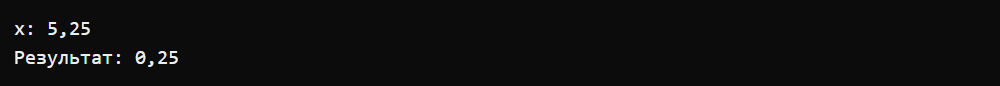

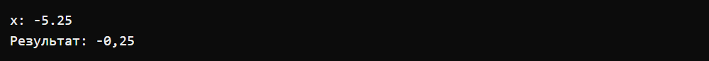

## Задача 2

### Текст задачи

```text
Букву в число.
Дана сигнатура метода: public int charToNum (char x);
Метод принимает символ х, который представляет собой один из “0 1 2 3 4 5 6 7
8 9”. Необходимо реализовать метод таким образом, чтобы он преобразовывал
символ в соответствующее число. Подсказка: код символа ‘0’ — это число 48.
Пример:
x=’3’
результат: 3
```

### Алгоритм решения

Вычесть из кода входного символа код символа '0'. Полученная разница равна цифре.

### Тестирование

| Последовательность ввода исходных данных | Полученный результат |
| --- | --- |
| `3` | `3` |
| `a; 12; 0` | `0` |

Второй запуск показывает проверку ограничения и успешный повторный ввод.


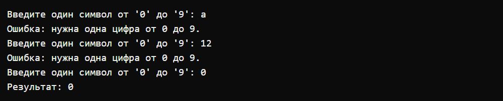

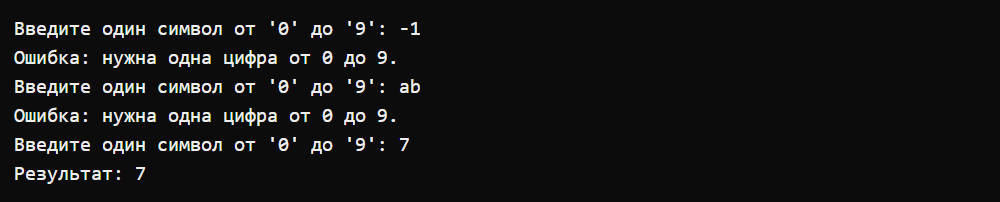

## Задача 3

### Текст задачи

```text
Двузначное.
Дана сигнатура метода: public bool is2Digits (int x);
Необходимо реализовать метод таким образом, чтобы он принимал число x и
возвращал true, если оно двузначное.
Пример 1:
x=32
результат: true
Пример 2:
x=516
результат: false
```

### Алгоритм решения

Проверить, находится ли x в диапазоне 10–99 или -99…-10. Знак минус не считается цифрой.

### Тестирование

| Последовательность ввода исходных данных | Полученный результат |
| --- | --- |
| `32` | `true` |
| `516` | `false` |

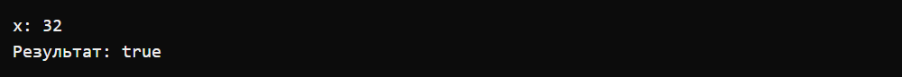


## Задача 4

### Текст задачи

```text
Диапазон.
Дана сигнатура метода: public bool isInRange (int a, int b, int num);
Метод принимает левую и правую границу (a и b) некоторого числового
диапазона. Необходимо реализовать метод таким образом, чтобы он возвращал
true, если num входит в указанный диапазон (включая границы). Обратите
внимание, что отношение a и b заранее неизвестно (неясно кто из них больше, а
кто меньше)
Пример 1:
a=5 b=1 num=3
результат: true
Пример 2:
a=2 b=15 num=33
результат: false
```

### Алгоритм решения

Проверить a ≤ num ≤ b или b ≤ num ≤ a. Обе проверки включают границы и учитывают любой порядок a и b.

### Тестирование

| Последовательность ввода исходных данных | Полученный результат |
| --- | --- |
| `5; 1; 3` | `true` |
| `2; 15; 33` | `false` |

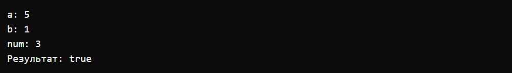

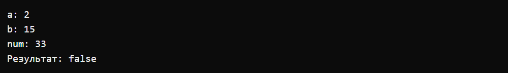

## Задача 5

### Текст задачи

```text
Равенство.
Дана сигнатура метода: public bool isEqual(int a, int b, int c);
Необходимо реализовать метод таким образом, чтобы он возвращал true, если
все три полученных методом числа равны
Пример 1:
a=3 b=3 с=3
результат: true
Пример 2:
a=2 b=15 с=2
результат: false
```

### Алгоритм решения

Сравнить a с b, затем b с c. Вернуть true, только если оба сравнения выполняются.

### Тестирование

| Последовательность ввода исходных данных | Полученный результат |
| --- | --- |
| `3; 3; 3` | `true` |
| `2; 15; 2` | `false` |

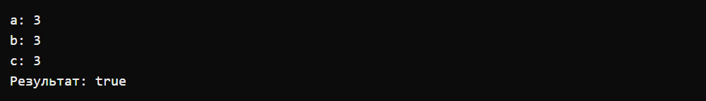

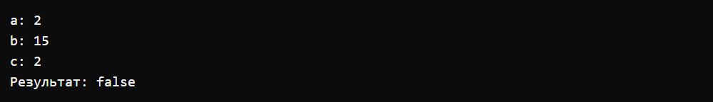

# Задание 2

## Задача 1

### Текст задачи

```text
Модуль числа.
Дана сигнатура метода: public int abs (int x);
Необходимо реализовать метод таким образом, чтобы он возвращал модуль
числа х (если оно было положительным, то таким и остается, если он было
отрицательным – то необходимо вернуть его без знака минус).
Пример 1:
x=5
результат: 5
Пример 2:
x=-3
результат: 3
```

### Алгоритм решения

Если x меньше нуля, вернуть -x. Иначе вернуть x.

Значение -2147483648 не принимается: его положительный модуль не помещается в возвращаемый тип int.

### Тестирование

| Последовательность ввода исходных данных | Полученный результат |
| --- | --- |
| `-3` | `3` |
| `-2147483648; 5` | `5` |

Второй запуск показывает проверку ограничения и успешный повторный ввод.

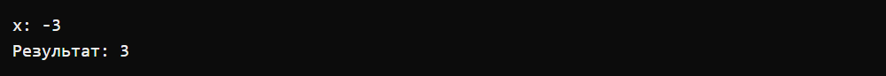

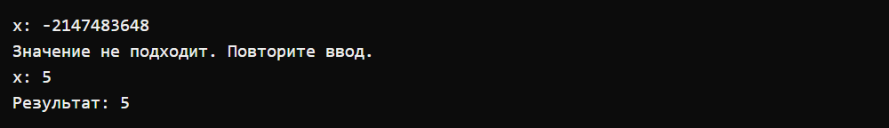

## Задача 2

### Текст задачи

```text
Тридцать пять.
Дана сигнатура метода: public bool is35 (int x);
Необходимо реализовать метод таким образом, чтобы он возвращал true, если
число x делится нацело на 3 или 5. При этом, если оно делится и на 3, и на 5, то
вернуть надо false. Подсказка: оператор % позволяет получить остаток от
деления.
Пример 1:
x=5
результат: true
Пример 2:
x=8
результат: false
Пример 3:
x=15
результат: false
```

### Алгоритм решения

Если x делится одновременно на 3 и 5, вернуть false. Иначе проверить, равен ли нулю хотя бы один из остатков от деления на 3 и на 5.

### Тестирование

| Последовательность ввода исходных данных | Полученный результат |
| --- | --- |
| `5` | `true` |
| `8` | `false` |

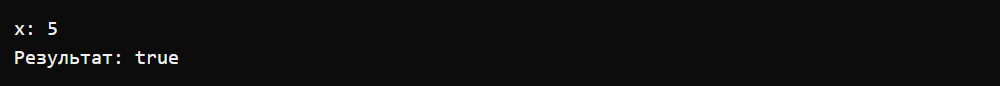

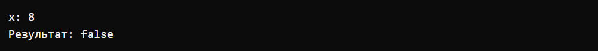

## Задача 3

### Текст задачи

```text
Тройной максимум.
Дана сигнатура метода: public int max3 (int x, int y, int z);
Необходимо реализовать метод таким образом, чтобы он возвращал
максимальное из трех полученных методом чисел. Подсказка: идеальное
решение включает всего две инструкции if и не содержит вложенных if.
Пример 1:
x=5 y=7 z=7
результат: 7
Пример 2:
x=8 y=-1 z=4
результат: 8
```

### Алгоритм решения

Записать x в maximum. Первым if заменить максимум на y, если y больше. Вторым if заменить максимум на z, если z больше. Вернуть maximum.

### Тестирование

| Последовательность ввода исходных данных | Полученный результат |
| --- | --- |
| `5; 7; 7` | `7` |
| `8; -1; 4` | `8` |

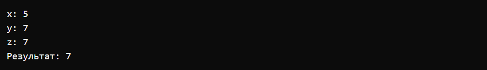

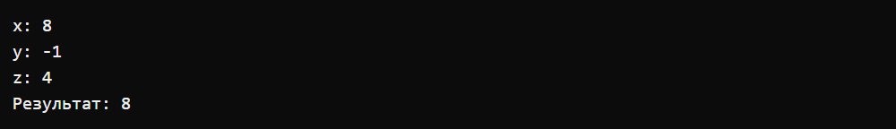

## Задача 4

### Текст задачи

```text
Двойная сумма.
Дана сигнатура метода: public int sum2 (int x, int y);
Необходимо реализовать метод таким образом, чтобы он возвращал сумму
чисел x и y. Однако, если сумма попадает в диапазон от 10 до 19, то надо вернуть
число 20.
Пример 1:
x=5 y=7
результат: 20
Пример 2:
x=8 y=-1
результат: 7
```

### Алгоритм решения

Вычислить сумму x + y. Если она находится от 10 до 19 включительно, вернуть 20. Иначе вернуть вычисленную сумму.

Каждое слагаемое ограничено миллиардом по модулю, чтобы сумма помещалась в int.

### Тестирование

| Последовательность ввода исходных данных | Полученный результат |
| --- | --- |
| `5; 7` | `20` |
| `1000000001; 8; -1` | `7` |

Второй запуск показывает проверку ограничения и успешный повторный ввод.

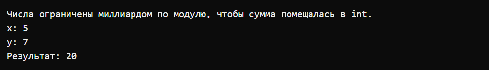

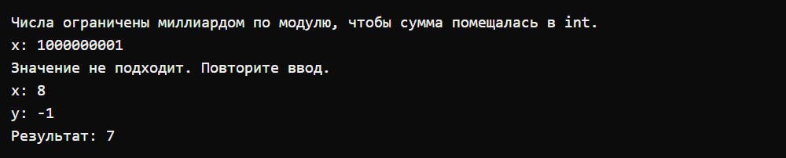

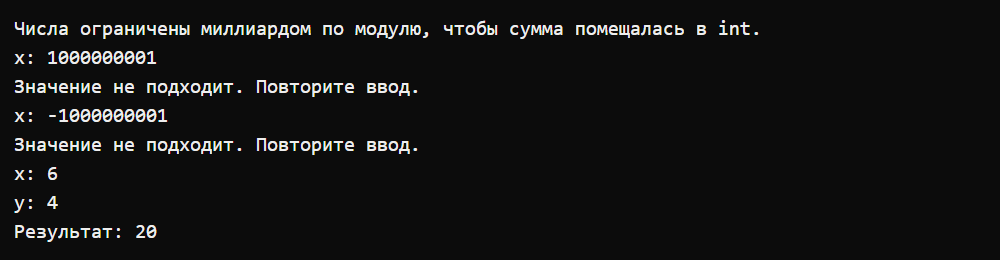

## Задача 5

### Текст задачи

```text
День недели.
Дана сигнатура метода: public String day (int x);
Метод принимает число x, обозначающее день недели. Необходимо реализовать
метод таким образом, чтобы он возвращал строку, которая будет обозначать
текущий день недели, где 1- это понедельник, а 7 – воскресенье. Если число не
от 1 до 7 то верните текст “это не день недели”. Вместо if в данной задаче
используйте switch.
Пример:
x=5
результат: “пятница”
```

### Алгоритм решения

С помощью switch для 1–7 вернуть название соответствующего дня недели, а через default для остальных значений вернуть «это не день недели».

Значения вне 1–7 принимаются намеренно: для них условие требует вернуть сообщение. Формат числа и диапазон int проверяются.

### Тестирование

| Последовательность ввода исходных данных | Полученный результат |
| --- | --- |
| `5` | `пятница` |
| `8` | `это не день недели` |

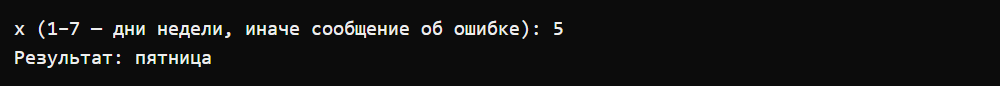

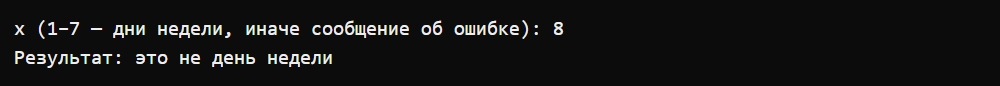

# Задание 3

## Задача 1

### Текст задачи

```text
Числа подряд.
Дана сигнатура метода: public String listNums (int x);
Необходимо реализовать метод таким образом, чтобы он возвращал строку, в
которой будут записаны все числа от 0 до x (включительно).
Пример:
x=5
результат: “0 1 2 3 4 5”
```

### Алгоритм решения

Начать строку с «0». Циклом for перебрать числа от 1 до x включительно и добавить каждое через пробел.

### Тестирование

| Последовательность ввода исходных данных | Полученный результат |
| --- | --- |
| `5` | `0 1 2 3 4 5` |
| `-1; 0` | `0` |

Второй запуск показывает проверку ограничения и успешный повторный ввод.

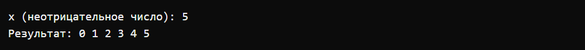

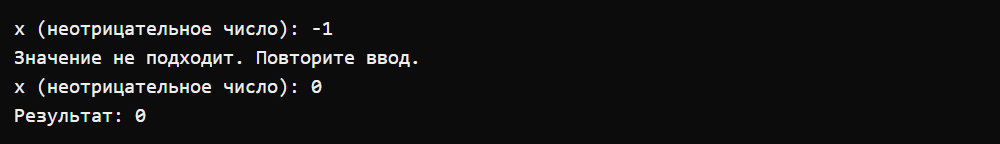

## Задача 2

### Текст задачи

```text
Четные числа.
Дана сигнатура метода: public String chet (int x);
Необходимо реализовать метод таким образом, чтобы он возвращал строку, в
которой будут записаны все четные числа от 0 до x (включительно). Подсказа
для обеспечения качества кода: инструкцию if использовать не следует.
Пример:
x=9
результат: “0 2 4 6 8”
```

### Алгоритм решения

Начать строку с «0». Циклом for перебирать числа от 2 до x с шагом 2 и добавлять их через пробел. Инструкция if не нужна.

### Тестирование

| Последовательность ввода исходных данных | Полученный результат |
| --- | --- |
| `9` | `0 2 4 6 8` |
| `-4; 2` | `0 2` |

Второй запуск показывает проверку ограничения и успешный повторный ввод.

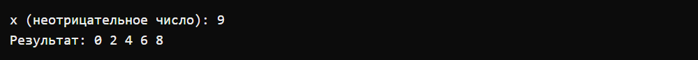

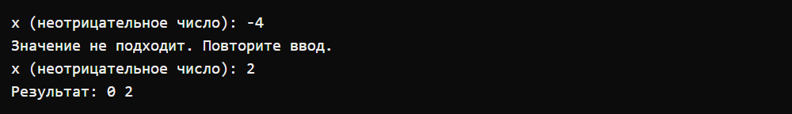

## Задача 3

### Текст задачи

```text
Длина числа.
Дана сигнатура метода: public int numLen (long x);
Необходимо реализовать метод таким образом, чтобы он возвращал количество
знаков в числе x.
Подсказка:
Int у=123/10; // у будет иметь значение 12
Пример:
x=12567
результат: 5
```

### Алгоритм решения

В цикле do while увеличить счётчик и разделить x на 10. Повторять, пока x не станет нулём. Цикл выполняется хотя бы один раз, поэтому длина числа 0 равна 1. Деление работает и с отрицательными числами; знак минус не учитывается.

### Тестирование

| Последовательность ввода исходных данных | Полученный результат |
| --- | --- |
| `12567` | `5` |
| `0` | `1` |

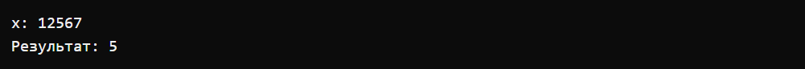

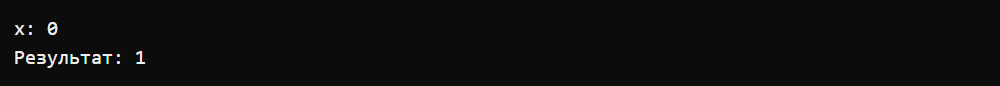

## Задача 4

### Текст задачи

```text
Квадрат.
Дана сигнатура метода: public void square (int x);
Необходимо реализовать метод таким образом, чтобы он выводил на экран
квадрат из символов ‘*’ размером х, у которого х символов в ряд и х символов в
высоту.
Пример 1:
x=2
результат:
**
**
Пример 2:
x=4
результат:
****
****
****
****
```

### Алгоритм решения

Внешним циклом for вывести x строк. В каждой строке внутренним циклом вывести x звёздочек, затем перейти на новую строку.

### Тестирование

| Последовательность ввода исходных данных | Полученный результат |
| --- | --- |
| `4` | `**** / **** / **** / ****` |
| `-2; 0; 2` | `** / **` |

Второй запуск показывает проверку ограничения и успешный повторный ввод.

В таблице `/` обозначает переход на следующую строку.

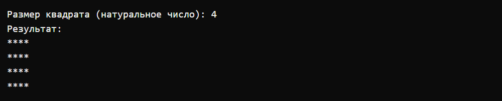

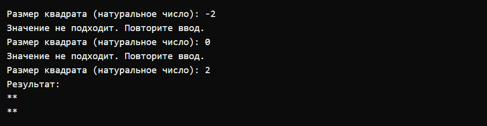

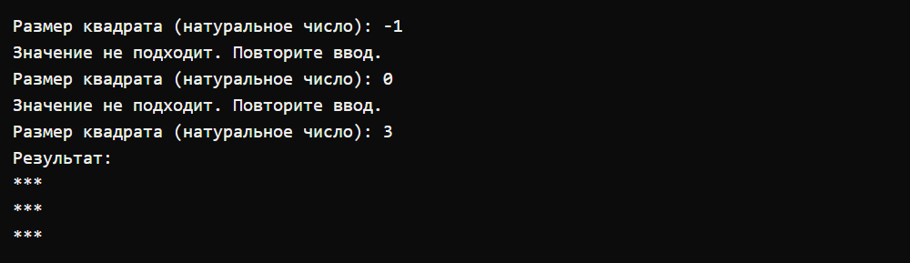

## Задача 5

### Текст задачи

```text
Правый треугольник.
Дана сигнатура метода: public void rightTriangle (int x);
Необходимо реализовать метод таким образом, чтобы он выводил на экран
треугольник из символов ‘*’ у которого х символов в высоту, а количество
символов в ряду совпадает с номером строки, при этом треугольник выровнен
по правому краю. Подсказка: перед символами ‘*’ следует выводить
необходимое количество пробелов.
Пример 1:
x=3
результат:
  *
 **
***
Пример 2:
x=4
результат:
   *
  **
 ***
****
```

### Алгоритм решения

Перебирать номер строки от 1 до x. Вывести x минус номер строки пробелов, затем столько звёздочек, каков номер строки, и перейти на новую строку.

### Тестирование

| Последовательность ввода исходных данных | Полученный результат |
| --- | --- |
| `4` | `   * /   ** /  *** / ****` |
| `-3; 0; 3` | `  * /  ** / ***` |

Второй запуск показывает проверку ограничения и успешный повторный ввод.

В таблице `/` обозначает переход на следующую строку.

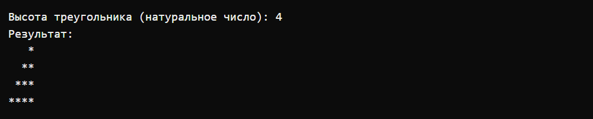

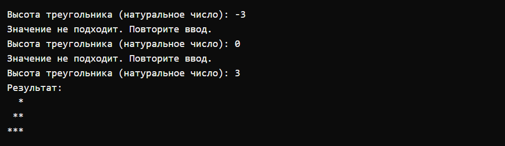

# Задание 4

## Задача 1

### Текст задачи

```text
Поиск первого значения.
Дана сигнатура метода: public int findFirst (int[] arr, int x);
Необходимо реализовать метод таким образом, чтобы он возвращал индекс
первого вхождения числа x в массив arr. Если число не входит в массив –
возвращается -1.
Пример:
arr=[1,2,3,4,2,2,5]
x=2
результат: 1
```

### Алгоритм решения

Последовательно перебирать массив от индекса 0. При первом совпадении с x вернуть индекс элемента. Если совпадений нет, вернуть -1.

### Тестирование

| Последовательность ввода исходных данных | Полученный результат |
| --- | --- |
| `7; 1; 2; 3; 4; 2; 2; 5; 2` | `1` |
| `-1; 0; 9` | `-1` |

Сначала вводятся длина массива и его элементы. Для вставки затем вводятся второй массив и позиция; для поиска — искомое число. Недопустимая длина или позиция запрашивается повторно.

Второй запуск показывает проверку ограничения и успешный повторный ввод.

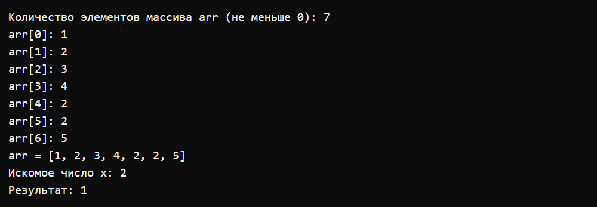

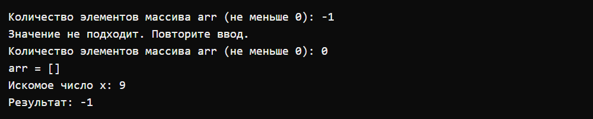

## Задача 2

### Текст задачи

```text
Поиск максимального.
Дана сигнатура метода: public int maxAbs (int[] arr);
Необходимо реализовать метод таким образом, чтобы он возвращал
наибольшее по модулю (то есть без учета знака) значение массива arr.
Пример:
arr=[1,-2,-7,4,2,2,5]
результат: -7
```

### Алгоритм решения

Сохранить первый элемент массива как максимум. Перебирать остальные элементы и сравнивать их модули с модулем максимума. При большем модуле сохранить сам элемент вместе со знаком. Вернуть сохранённый элемент.

Массив должен быть непустым. При равных модулях остаётся первый элемент. Перед Math.Abs значение приводится к long, чтобы обработать int.MinValue.

### Тестирование

| Последовательность ввода исходных данных | Полученный результат |
| --- | --- |
| `7; 1; -2; -7; 4; 2; 2; 5` | `-7` |
| `0; -1; 1; 7` | `7` |

Сначала вводятся длина массива и его элементы. Для вставки затем вводятся второй массив и позиция; для поиска — искомое число. Недопустимая длина или позиция запрашивается повторно.

Второй запуск показывает проверку ограничения и успешный повторный ввод.

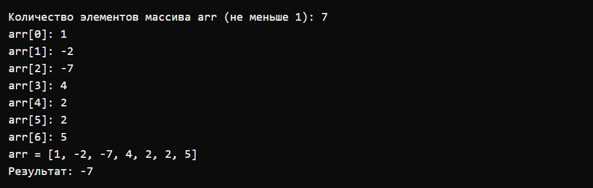

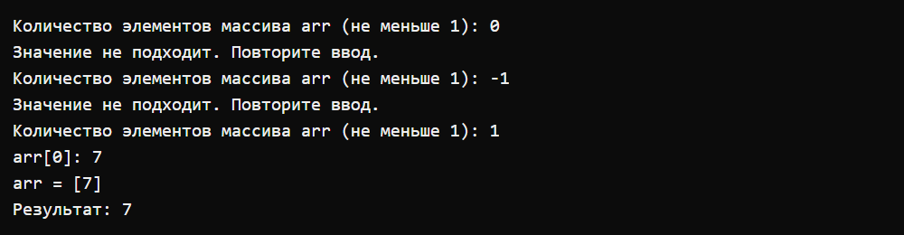

## Задача 3

### Текст задачи

```text
Добавление массива в массив.
Дана сигнатура метода: public int[] add (int[] arr, int[] ins, int pos);
Необходимо реализовать метод таким образом, чтобы он возвращал новый
массив, который будет содержать все элементы массива arr, однако в позицию
pos будут вставлены значения массива ins.
Пример:
arr=[1,2,3,4,5]
ins=[7,8,9]
pos=3
результат: [1,2,3,7,8,9,4,5]
```

### Алгоритм решения

Создать массив длиной arr.Length + ins.Length. Тремя циклами скопировать элементы arr до позиции pos, все элементы ins, затем оставшиеся элементы arr. Исходные массивы не изменяются.

Позиция вставки допустима от 0 до длины arr включительно. Позиция arr.Length означает вставку в конец.

### Тестирование

| Последовательность ввода исходных данных | Полученный результат |
| --- | --- |
| `5; 1; 2; 3; 4; 5; 3; 7; 8; 9; 3` | `[1, 2, 3, 7, 8, 9, 4, 5]` |
| `-1; 2; 1; 2; 1; 7; -1; 3; 2` | `[1, 2, 7]` |

Сначала вводятся длина массива и его элементы. Для вставки затем вводятся второй массив и позиция; для поиска — искомое число. Недопустимая длина или позиция запрашивается повторно.

Второй запуск показывает проверку ограничения и успешный повторный ввод.

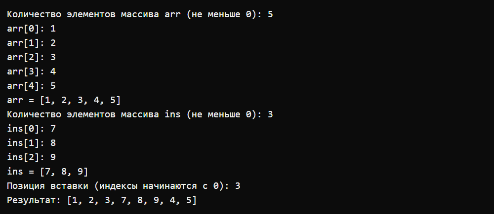

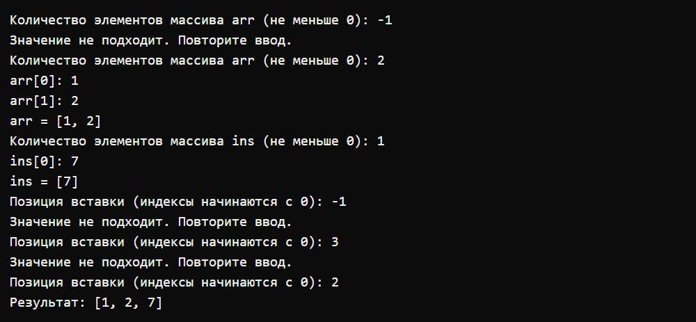

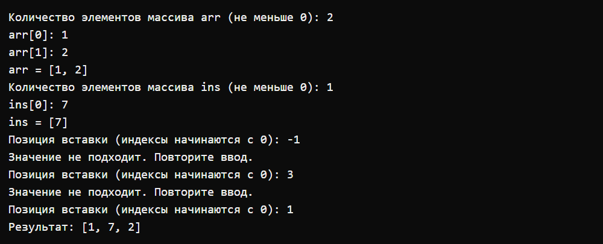

## Задача 4

### Текст задачи

```text
Возвратный реверс.
Дана сигнатура метода: public int[] reverseBack (int[] arr);
Необходимо реализовать метод таким образом, чтобы он возвращал новый
массив, в котором значения массива arr записаны задом наперед.
Пример:
arr=[1,2,3,4,5]
результат: [5,4,3,2,1]
```

### Алгоритм решения

Создать новый массив такой же длины. Для каждого индекса i записать элемент исходного массива с индексом arr.Length - 1 - i. Вернуть новый массив.

После результата программа выводит исходный массив, подтверждая, что он не изменён.

### Тестирование

| Последовательность ввода исходных данных | Полученный результат |
| --- | --- |
| `5; 1; 2; 3; 4; 5` | `[5, 4, 3, 2, 1]` |
| `0` | `[]` |

Сначала вводятся длина массива и его элементы. Для вставки затем вводятся второй массив и позиция; для поиска — искомое число. Недопустимая длина или позиция запрашивается повторно.

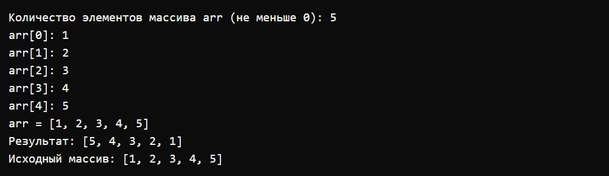

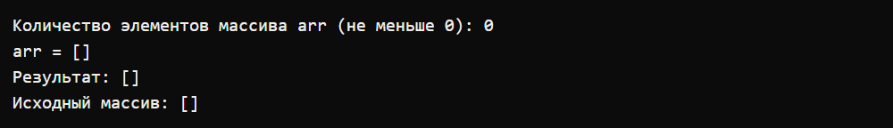

## Задача 5

### Текст задачи

```text
Все вхождения.
Дана сигнатура метода: public int[] findAll (int[] arr, int x);
Необходимо реализовать метод таким образом, чтобы он возвращал новый
массив, в котором записаны индексы всех вхождений числа x в массив arr.
Пример:
arr=[1,2,3,8,2,2,9]
x=2
результат: [1,4,5]
```

### Алгоритм решения

Первым циклом посчитать элементы, равные x. Создать массив индексов этой длины. Вторым циклом записать индексы всех совпадений по порядку. Если совпадений нет, вернуть пустой массив.

### Тестирование

| Последовательность ввода исходных данных | Полученный результат |
| --- | --- |
| `7; 1; 2; 3; 8; 2; 2; 9; 2` | `[1, 4, 5]` |
| `2; 1; 2; 9` | `[]` |

Сначала вводятся длина массива и его элементы. Для вставки затем вводятся второй массив и позиция; для поиска — искомое число. Недопустимая длина или позиция запрашивается повторно.

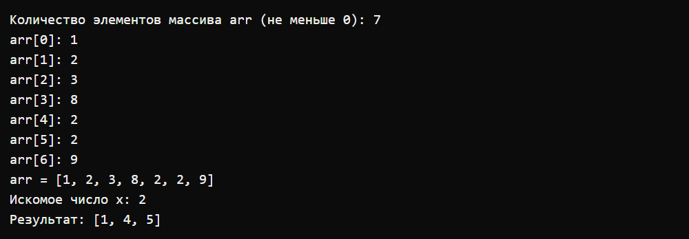

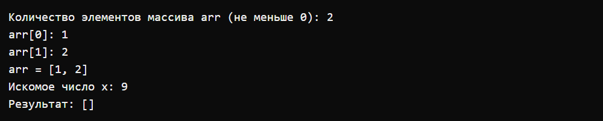

Изображения показывают фактические протоколы запусков: вывод программы и переданные строки ввода. Протоколы отображены моноширинным шрифтом на фоне терминала, без внешних заголовков и подписей.
